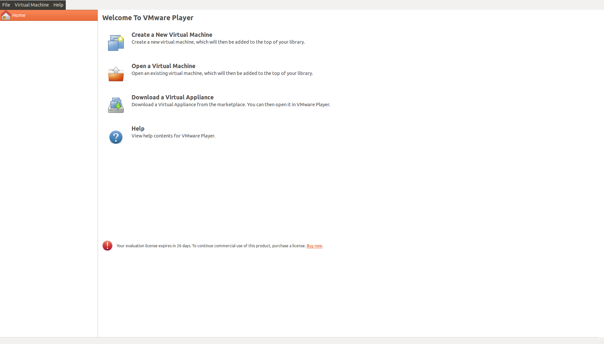
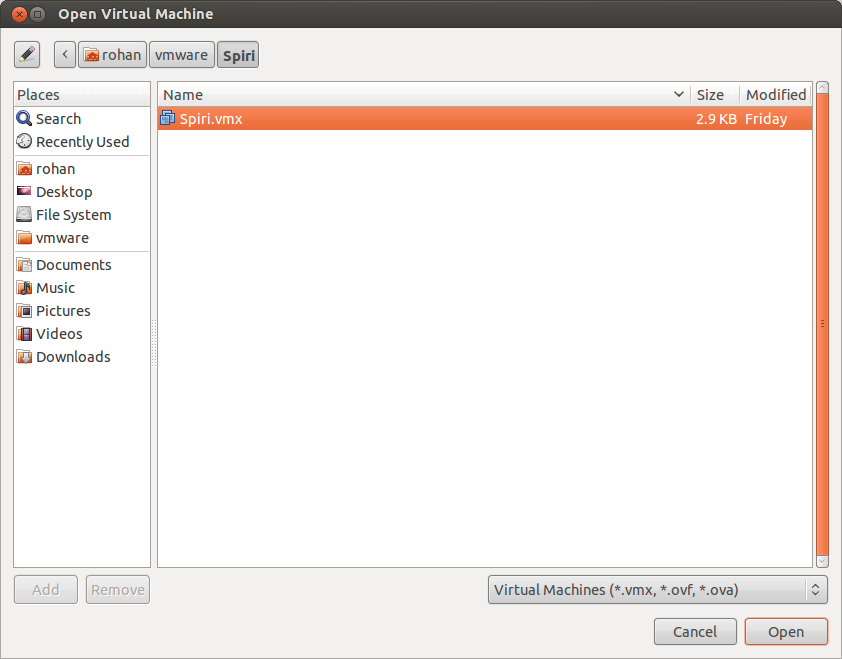
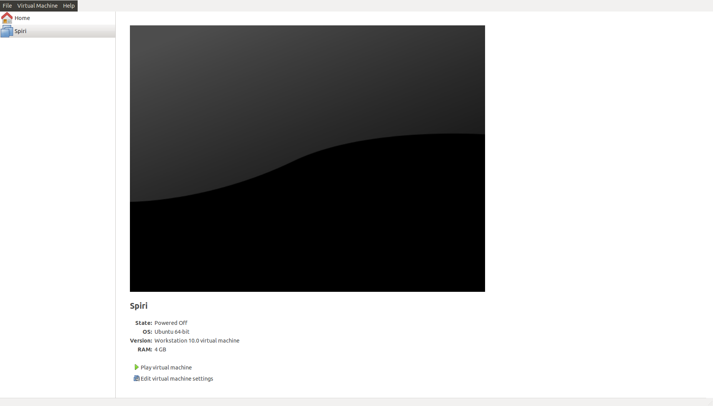

Installing the Simulator
====================

We have created installation scripts to install ROS, Gazebo and Spiri's simulator to ease the process of installing. 

If users already have some of the components installed they can install the rest by following the section Install different components independtly.

For OSx and Windows users we have created virtual machines which can be run using VMware player in Windows and VMware Fusion in OSx.

VMware player is free for use on Windows. VMware Fusion has a free trial for 30 days on OSx.

Install using Scripts - Ubuntu 12.04/12.10/13.04
--------------------

::

	>$ wget https://raw.github.com/Pleiades-Spiri/Spiri_Public/Simulator-alpha-1.1/installation.sh
	>$ wget https://raw.github.com/Pleiades-Spiri/Spiri_Public/Simulator-alpha-1.1/installation_simulator.sh
	>$ chmod +x installation.sh installation_simulator.sh
	>$ ./installation.sh

**Restart** the terminal and run

::
	
	>$ ./installation_simulator.sh

	
This will install ROS in `/opt/` and Spiri's simulator in `/home/${user}/catkin_ws/src`. 

Install different components independently
--------------------

- Install `ROS <http://wiki.ros.org/hydro/Installation/Ubuntu>`_.

Install the ros-dekstop-full package as it contains Gazebo and other programs required for the simulator.

- Install Gazebo sensor plugins

::

	>$ sudo apt-get install ros-hydro-hector-quadrotor

- Install Controllers

::

	>$ sudo apt-get install ros-hydro-ros-controllers

- Install joystick drivers

::
	
	>$ sudo apt-get install ros-hydro-joy

- Create a `ROS workspace <http://wiki.ros.org/ROS/Tutorials/InstallingandConfiguringROSEnvironment>`_.

After this step there should be a folder called as catkin_ws or the name you choose for your repository.

- Get the simulator

:: 

	>$ cd catkin_ws/src

	>$ wget https://raw.github.com/Pleiades-Spiri/Spiri_Public/Simulator-alpha-1.1./Simulator-1.1.1.tar.gz

	>$ tar -zxvf Simulator-1.1.1.tar.gz

	>$ mv Simulator-1.1.1 ./Simulator
	
	>$ cd .. && catkin_make

	>$ echo "export GAZEBO_MODEL_PATH=$GAZEBO_MODEL_PATH:~/catkin_ws/src/Simulator/spiri_description/models" >> ~/.bashrc

	>$ source ~/.bashrc

This will build the simulator in your catkin_ws.

Note just make sure that these commands are in your **bashrc**

::

	source ~/catkin_ws/devel/setup.bash

	source /opt/ros/hydro/setup.bash

	export GAZEBO_MODEL_PATH=$GAZEBO_MODEL_PATH:~/catkin_ws/src/Simulator/spiri_description/models

Install on Windows
---------------------

We have created a virtual image which contains Ubuntu 12.04 with ROS and Spiri’s simulator. You can run the virtual image using VMware player which is available free of cost.

- Download the virtual image `here <https://www.dropbox.com/s/r7ddbupv3j7mnox/Spiri.zip>`_.

- Unzip the file

- Open VMware player and choose "Open a Virtual Machine".

- Browse to the Spiri Folder and choose Spiri.vmx file

- Click on "Play Virtual Machine"

**Username** - spiri **Password** - spiri

Install on OSx
---------------------

We have created a virtual image which contains Ubuntu 12.04 with ROS and Spiri’s simulator. You can run the virtual image using `VMware Fusion <http://www.vmware.com/products/fusion>`_ which is available as a 30-day free trial.

- Download the virtual image `here <https://www.dropbox.com/s/r7ddbupv3j7mnox/Spiri.zip>`_.

- Unzip the file

- Open VMware Fusion and choose "Open a Virtual Machine".

- Browse to the Spiri Folder and choose Spiri.vmx file

- Click on "Play Virtual Machine"

**Username** - spiri **Password** - spiri
