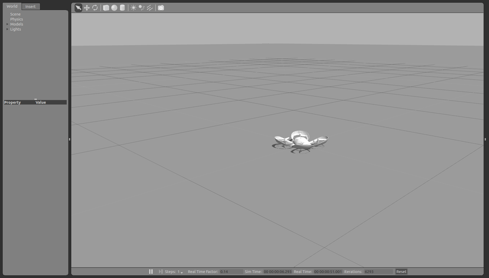
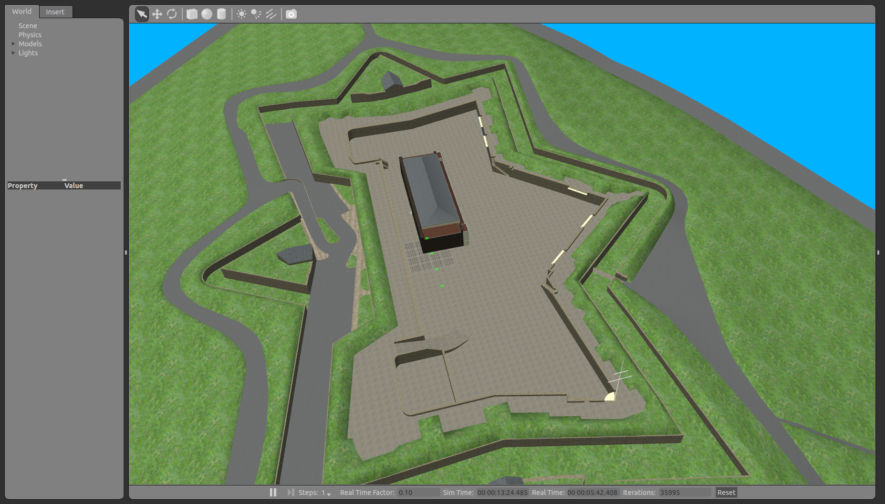

Simulating Spiri
====================

Pleiades has created a simulation environment for Spiri built on
the open source simulator `Gazebo <http://gazebosim.org>`_. This simulator
allows you to test certain pieces of code even when you do not have access to
a robot, or before running certain code on the actual robot.

It should be noted that this is a simulation, and is certainly not a perfect
model of the world or the robot. Results between real world and simulation may
vary wildly at times. Be sure to also note the limitations and differences
of the simulated Spiri which are listed at the bottom of this page.

Starting the Simulator
----------------------

To start the simulator, you will run one of several roslaunch files. Each roslaunch file
brings up a different environment. 

* The shortcut for opening terminal in Ubuntu is Ctrl+Alt+t

The simplest environment is started by running the following command in terminal:
::

    >$ roslaunch spiri_description spiri_empty_world.launch

This environment includes nothing except a robot and the floor.

   

There are several other environments:

The following command launches a model of Citadel Hill, Halifax:

 ::
 
    >$ roslaunch spiri_description spiri_citadel.launch
 
 

   
*More enviornments will be added before the final realease

Following Spiri in your Scene
----------------------------

Follow Spiri by selecting World> Models> from the left hand menu. Right click on Spiri to open a pop-up menu, select Follow.

Teleoperating the Simulated Spiri
---------------------------------

The **spiri_teleop** package includes a number of scripts for commanding the robot
to move its joints in certain ways. The first thing you probably want to do is
drive the robot around. 

* Using Joystick such as logitech gamepad or xbox 360 controller

In a new terminal window:
::

    >$ roslaunch spiri_teleop logitech_gamepad.launch
    >$ roslaunch spiri_telop  xbox_controller.launch

* The **keyboard_teleop** node allows you to control Spiri with your computer keyboard

In a new terminal window:
::

    >$ roslaunch spiri_teleop keyboard_teleop.launch
    
    Reading from keyboard
    -------------------------
   Moving around:
   u    i    o
   j    k    l
   m    ,    .
  p   : move up in z direction
  ;   : move down in z directions
  h   : hover
  n   : land
  Press any other key to stop the robot

Now, if you press the 'p' key, the robot will go up.

One thing to note is how the topics are connected.
The **keyboard_teleop** or **quadrotor_teleop**
node publishes to a topic called ``cmd_vel``. The controllers for Spiri listens to the ``cmd_vel`` topic and translate the velocity to thrust and force to move Spiri in the simulator.

Differences and Limitations
---------------------------

The simulated robot is not exactly the same as the real robot. Notable differences
include:

Coming soon.

